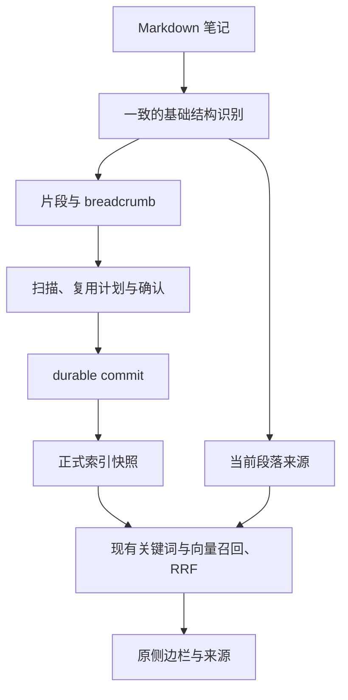

# Markdown 结构一致性与安全索引升级

Status: implemented
Spec stage: 两票resolved，实现与独立macOS Vault验收完成

## Problem Statement

用户在 Obsidian 写作时，希望当前段落能找回正确的旧笔记原文。现有 Markdown 结构判断可能把围栏代码中的井号注释当成标题，丢失该行正文并把后续内容归入错误 breadcrumb；Setext 标题在查询来源中被识别，在索引分块中却作为正文处理。错误结构同时影响关键词输入、文档 embedding 和查询范围。

本次调查已用两个纯函数样例复现上述行为。尚未测量它们在用户真实笔记中的占比，不能宣称修复会带来某个相关性提升比例。

目标是借鉴 ZG 中对当前产品有价值的 Markdown 结构识别，修正这条输入链路，同时控制代码、迁移和长期维护成本。无需复制其完整提取器、章节实体或检索后端。

## Solution

索引分块与当前段落查询遵守一致的基础规则：frontmatter、围栏代码和真正标题能被区分，代码中的标题样式文本保持为内容，章节上下文不被代码注释污染。保留现有段落大小、混合检索、侧边栏和显式选区操作。

本次分块语义升级通过现有全量重建流程应用。旧索引不会被启动过程清除，也不会自动付出整库 embedding 成本；用户先查看重建预览，确认后才执行。模型兼容且文件名、breadcrumb、正文完全相同的旧片段向量可以复用。

## User Stories

1. 作为写作者，我希望代码中的井号注释保留为正文，以便它能够参与检索和原文引用。
2. 作为写作者，我希望代码里的标题样式文本不改变章节上下文，以便后面的笔记归入正确标题。
3. 作为写作者，我希望反引号和波浪号围栏都被识别，以便常用 Markdown 写法行为一致。
4. 作为写作者，我希望正在编辑的未闭合围栏仍被视为代码区域，以免暂时未写完的代码污染标题结构。
5. 作为写作者，我希望过短或不同字符的围栏不会错误结束代码区域，以便内容含有围栏样式文本时仍正确。
6. 作为写作者，我希望 Setext 标题进入 breadcrumb，以便关键词与向量能够利用章节上下文。
7. 作为写作者，我希望真正标题行不被当成默认查询正文，以便查询范围仍是正在写的段落。
8. 作为写作者，我希望代码正文里的井号不让查询突然变成空段落，以便在代码附近移动光标时行为可理解。
9. 作为写作者，我希望围栏分隔行与空行不触发全文回退，以便没有有效段落时保持等待。
10. 作为写作者，我希望围栏外的相邻正文仍按空行和标题划分，以便原有写作习惯不变。
11. 作为写作者，我希望合法 frontmatter 不进入索引或默认段落查询，以便属性不成为正文检索输入。
12. 作为写作者，我希望仍能显式选择任意文本查询，以便主动指定的查询不被自动段落规则改写。
13. 作为写作者，我希望换段、换文件后旧响应不能覆盖新上下文，以便结果对应当前写作位置。
14. 作为写作者，我希望结果来源位置仍指向原始笔记，以便打开来源和插入引用保持正确。
15. 作为已有用户，我希望升级不会清除旧索引，以便取消或失败后数据仍被保留。
16. 作为已有用户，我希望升级需要重建时得到明确提示，以便知道尚未启用新版索引语义。
17. 作为已有用户，我希望确认前能看到可复用与待生成片段数量，以便判断升级成本。
18. 作为已有用户，我希望未改变语义输入的片段复用原向量，以便分块升级不必重新 embedding 全库。
19. 作为已有用户，我希望模型不兼容时不复用旧向量，以便结果不会混合不同向量空间。
20. 作为已有用户，我希望取消、失败或过期重建不发布半成品，以便索引和关键词缓存保持一致。
21. 作为已有用户，我希望排除范围仍区分期望范围和实际生效范围，以便升级不偷偷改变索引覆盖范围。
22. 作为维护者，我希望查询与索引共享必要的结构判断，以便不再分别修补两套围栏和标题规则。
23. 作为维护者，我希望测试通过现有公开行为验证结果，以便内部实现可以简化而不破坏契约。

## Implementation Decisions

### 范围与模块职责

- 保留现有 Markdown chunker、QuerySourceCoordinator、扫描、重建计划、PersistentIndex、IndexStore 和 HybridRetrieval 职责。
- 结构识别封装为最小的内部共享逻辑，接受 Markdown 文本并保留原始行位置。具体返回结构由实施决定，不先建设 AST、解析插件体系或可配置后端。
- chunker 负责片段组合和大小约束；查询来源负责光标附近段落。两者共享结构事实，不要求返回同样大小的文本。
- 不引入新的解析依赖或复制 ZG 提取器源码。借鉴公开 Markdown 规则和已核对的实现思想，不照搬上游较粗略的围栏关闭判断。

### 支持的基础 Markdown 规则

- 覆盖文档顶层、允许零到三个前导空格的 ATX 标题与围栏。围栏由至少三个连续反引号或波浪号开始；记录字符和长度。
- 围栏只能由相同字符、长度不短于起始标记、标记后仅空白的关闭行结束。反引号围栏的 info string 不得含反引号。不同字符或过短标记是代码内容。
- 未闭合围栏延伸到文末。围栏内不识别 ATX、Setext 或 frontmatter；代码内容不允许改变 breadcrumb。
- ATX 标题保持一至六级、标记后的空白或行尾要求及合法尾部井号处理；空标题仍是结构边界，不制造空 breadcrumb 项。
- Setext 标题由围栏外的紧邻单行非空普通文本和由等号或连字符构成的下划线组成，分别对应一、二级。下划线允许零到三个前导空格及尾随空白。没有合格前行的孤立标记不得借用更早文本成为标题；多行 Setext 标题与完整 CommonMark 容器优先级不在本次范围。
- 标题层级跳跃继续产生仅含已定义祖先的 breadcrumb。Setext 标题正文及下划线不进入片段正文，标题内容进入 breadcrumb。
- 保留现有文首 frontmatter 排除契约，包括现有关闭分隔符和未闭合时的处理；默认查询采用相同区间判断。不增加 YAML 解析器或扩大为所有横线区域排除。
- LF、CRLF 保持一致行为；源文件行号不能因去掉 frontmatter 或结构标记而重新编号。
- 不声称支持引用、列表容器中的嵌套围栏、缩进代码块或完整 CommonMark。这些形式不纳入本次新增解析能力。

### 片段与默认查询行为

- 围栏代码继续参与索引。保留代码正文、围栏原文与原始相对顺序，不把代码里的井号行提取成 breadcrumb 或删除。
- 沿用现有片段目标长度、最大长度和最小长度策略。长代码仍允许按预算分片，不要求每片是独立可渲染代码块，不补写原文件没有的围栏，不引入重叠窗口。
- 普通笔记中不受新规则影响的片段应保持原有正文和 breadcrumb；版本升级可改变 chunk ID，但不能因此改变语义复用判断。
- 默认查询在标题行（包括 Setext 两行）、frontmatter、围栏开启与关闭行、空行上返回空来源，维持等待，不回退全文。
- 光标在围栏正文时，以该围栏区间内的空行为段落边界；标题样式字符按普通内容处理。查询不得跨越开关围栏或延伸到相邻普通正文。正文有效性仍使用至少八个非空白字符规则。
- 普通正文延续原有空行、标题边界；光标行缺失时不推断全文。单次选区、跟随选区、全选及阅读视图选区保留原语义，不套用默认段落过滤。
- 保留换段、编辑、换文件、隐藏面板和卸载后的旧响应屏障；同一段落内移动光标不新增重复查询。

### 分块版本与旧索引

- 将分块版本从当前版本 2 提升到 3；不改变 IndexedDB schema、Vault 身份、模型或 embedding 文本格式。所有本次分块语义变化合并到同一次版本升级。
- 旧索引载入后按现有身份比较标记 incompatible，提供全量重建入口。不静默按新语义使用旧分块、不自动重建、不开放对旧版本的普通增量 patch。
- 明确区分“保留旧索引数据”和“旧索引仍可查询”：版本不兼容时，新版插件保持重建提示，取消或失败后亦如此。不得承诺在新版中继续查询不兼容索引。
- 继续使用准备、预览确认、执行、durable commit 的现有流程。取消、失败或 stale plan 不替换旧正式快照；durable publication 开始后的取消规则保持原样。
- 重建复用要求旧、新索引模型与维度兼容，并按文件名、breadcrumb、正文做精确语义比较。chunk ID、分块版本、行号和源文件统计信息不能单独否定向量复用。
- 模型或维度不同，不得把旧 chunks 无条件传入复用路径；不能仅依赖按 ID 的复用入口被禁用。修正范围限于本次重建复用入口需要的模型兼容保护，不扩展模型身份体系。
- 预览应基于最终复用规则报告成本。扫描不调用 embedding；确认后仅为不可复用输入生成向量，重复输入沿用已有分组规则。
- 成功提交后才采用新快照并使派生关键词缓存失效；两路均使用新提交片段。保留有效范围、pending、deferred、恢复代和 Vault 事件的既有规则。

## Testing Decisions

### 测试 seam

优先复用公开入口，不增加 Obsidian 测试框架或暴露结构识别内部状态。所需行为天然跨越三个已有 seam，不强行压成一个巨大的模拟环境：

1. chunkMarkdown／scanIndexDocument：验证实际正文、breadcrumb、源行位置、稳定语义及结构合法性。
2. paragraphQuerySource／QuerySourceCoordinator 与响应判定：验证光标位置产生的查询范围及过期响应。
3. 重建计划、PersistentIndex／IndexStore 提交与 HybridRetrieval：验证升级状态、实际 embedding 输入、复用、取消和只查询已提交片段。

共享结构识别的内部类型、函数调用次数和拆了多少文件不作为测试目标。用户已明确要求跳过 seam 确认，直接写 spec 并拆票。

### 必须保护的行为

- 优先写会在修复前失败的测试：围栏中的井号注释不丢失、不改变后续 breadcrumb；Setext 标题在索引与默认查询中的结构判断一致。
- 使用覆盖边界而非组合爆炸的表驱动样例：两类围栏、info string、较长起始标记、过短／异类伪关闭、未闭合围栏、零到三个前导空格、CRLF。
- 用围栏前后有普通标题和正文的样例验证错误不会延续到下一个章节；验证源位置能够指回原文。
- 用同一 Markdown fixture 经分块与查询两个公开入口，验证共享语义；不要直接检查两个入口是否调用同一个 helper。
- 保护合法 frontmatter 排除、未闭合处理、孤立下划线、跳级标题和不受影响的普通段落。代码中的标题不得进入 embedding 的标题上下文。
- 用实际旧版本快照和可检查的 provider 替身，验证升级前 incompatible、未确认不 embedding、仅版本或位置变化可复用、正文／breadcrumb 改变需重算、不同模型或维度禁止复用。
- 通过现有持久化及取消 seam 验证旧 generation 在取消／失败后保留，成功后才发布新版；保留 stale-plan 回归，不重写完整存储故障测试体系。
- 使用真实 native 关键词公开入口验证修复后的代码正文可被召回、YAML 仍不进入关键词库、已提交新版替换旧 breadcrumb。受控向量只用于检验链路，不能当作相关性效果评测。
- 查询回归保留空来源不回退全文、八字符门槛、换段丢弃旧响应、选区及阅读视图行为。

### 先例、验证与交付

沿用现有中文 frontmatter／breadcrumb 分块 fixture、查询段落测试、embedding 语义复用、重建确认取消、IndexedDB generation 恢复及真实 Jieba 测试的组织方式。只新增保护本次具体风险的断言。

实施后运行 typecheck、全套测试、build。最终在独立测试 Vault 验证一条完整升级路径：旧版快照 → 重建提示 → 预览取消保留数据 → 确认重建 → 围栏／Setext 查询 → 来源打开及引用 → 插件重载。复用现有 macOS native 安装和 E2E 方式，记录完整目标路径及可检查结果；不操作正式 Vault。若真实环境不可用，明确记录未完成项目，不把自动化结果称为实机验收。

## Out of Scope

- 完整 CommonMark 解析器、AST、嵌套容器解析、通用 Markdown 重写。
- ZG 全量迁移、章节实体／片段双层模型、重叠窗口、分块长度调优。
- reranker、多查询规划、查询改写、融合权重调参、HNSW 或向量数据库迁移。
- 检索诊断平台、trace UI、独立性能或检索质量评测工程。
- 更换模型、修改 embedding 文本格式、扩展模型身份体系、重做增量调度。
- 缓存生命周期重构、跨启动关键词缓存、临时目录回收等独立优化。
- 正式 Vault 安装、正式索引重建、跨平台发布、Windows 同步、未经要求的提交。

## Further Notes

- ROI 判断：修复已复现的输入结构错误，同时改善两路输入的一致性；不保证实际相关性有量化提升。预计复杂度约 4/10，主要风险集中于旧索引身份与复用安全。
- ZG 参考来自本地 0.2.2 的 Markdown extractor、vector-content、召回／融合与存储代码；无需继续遍历它的 daemon、Rust 或多模型实现。
- spec／ticket编写阶段未授权实施；随后用户明确调用implement要求两票全部完成。已依序完成，未操作正式Vault。最终结果见[review与验收](reviews/final.md)。
- [01：正确索引 Markdown 并安全升级旧索引](issues/01-index-structure-upgrade.md)
- [02：一致的当前段落查询与整体验证](issues/02-query-structure-e2e.md)

## Comments

- 用户明确要求写完 spec 直接拆 ticket，不进行中间确认。本次文档不将之前讨论过的诊断、reranker 或存储改造自动加入范围。
- 随后用户要求使用implement连续完成两票。已实现、验证及review；提交按该skill执行，仅包含本任务，保留flomo-on-demand等其他工作。
