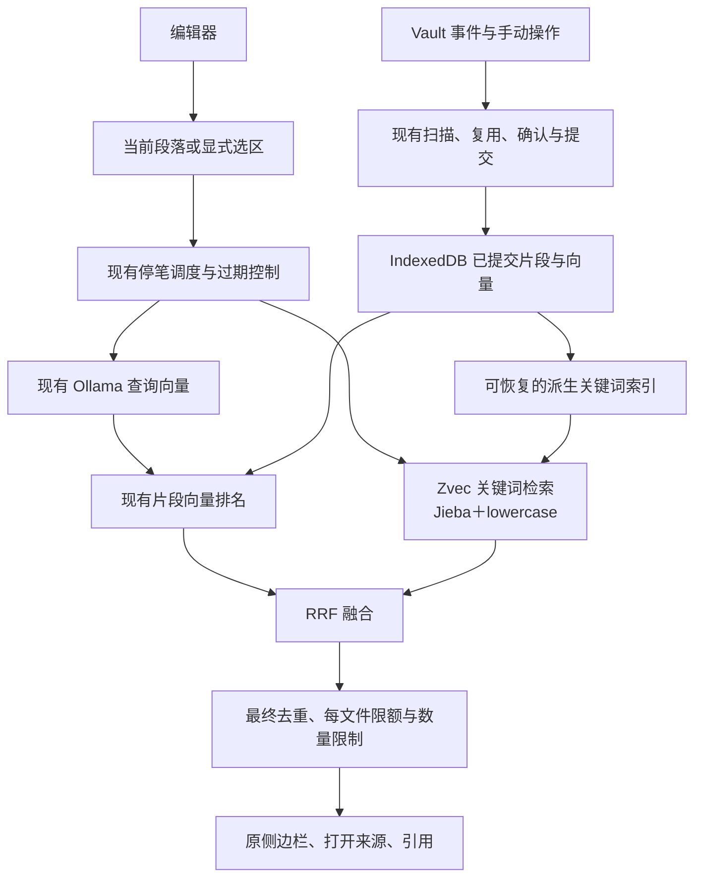

# Palimpsest 混合检索 Lite 与当前段落查询

Status: implemented
Spec stage: 四票已实施并完成本机验收
Execution scope: 用户已批准四票并要求全部完成，且通过 implement 指令明确要求提交。本机实现与验收已完成；没有发布、操作正式Vault或同步Windows。结果见[最终review与验收](reviews/02-04-final.md)。

## Problem Statement

用户希望在 Obsidian 写下一段话、短暂停笔后，原侧边栏浮现相关旧笔记原文片段，并能打开正确来源。

当前插件默认查询全文，只有向量召回。希望以 ZG 的实际拼装方式为蓝本：能复用就复用，保留现有适用的实现，删除不需要的能力，形成适合当前产品的精简检索链路。无需制作检索效果评测集，也不要求先证明新方案效果显著更好。

完整迁移 ZG 会改变现有模型、分块、更新、取消和存储方式。已有调查与探针表明，这些迁移并非引入关键词检索和融合的必要条件。

## Solution

保留现有 Markdown 分块、YAML 排除、Ollama embedding、片段级向量复用、IndexedDB 提交恢复和写作界面。直接复用 ZG 使用的 Zvec FTS/Jieba 作为关键词检索底层，参考其两路候选与 RRF 融合流程。

默认查询当前段落，保留显式选区及通过全选进行全文查询。关键词索引仅从已成功提交的片段派生，不成为第二个持久化真相源。

第一阶段交付用户当前 Mac 上可靠使用的原 Palimpsest。需要额外原生资源的本机安装目录，但不依赖开发仓库绝对路径。安装与真实 Obsidian 检查属于实施验收，不新增选型前置实验。

## User Stories

1. 作为写作者，我希望停笔后查询当前段落，以便围绕正在写的内容回顾旧笔记。
2. 作为写作者，我希望空段落或短段落不会偷偷退回全文，以便查询范围明确。
3. 作为写作者，我希望光标换段和切换笔记后旧请求失效，以便结果对应当前上下文。
4. 作为写作者，我希望显式查询选区，以及全选后查询全文，以便临时指定范围。
5. 作为现有用户，我希望保留跟随选区及阅读视图选区查询，以便继续使用已有操作。
6. 作为写作者，我希望同时找回相同措辞和不同措辞的相关片段，以便关键词召回与向量召回互补。
7. 作为写作者，我希望卡片仍展示原文、标题和来源，以便理解结果并回到笔记。
8. 作为写作者，我希望展开正文、插入链接和引用继续可用，以便不中断已有写作流程。
9. 作为写作者，我希望少量结果不会被重复文本或单篇笔记占满，以便看到不同来源。
10. 作为用户，我希望新增、修改、移动和删除笔记后两路检索一致更新，以便不出现过时片段。
11. 作为用户，我希望未成功提交的内容不会进入关键词结果，以便取消和失败仍符合已有承诺。
12. 作为用户，我希望排除范围设置与实际应用状态继续明确区分，以便知道当前检索范围。
13. 作为用户，我希望全量重建失败后继续使用旧索引，以便已有检索能力不丢失。
14. 作为用户，我希望重启或关键词缓存损坏后能够恢复检索，以便不需要清除已有向量索引。
15. 作为用户，我希望面板隐藏时暂停自动工作，以便避免无用的资源消耗。
16. 作为用户，我希望合法 YAML 属性不进入关键词检索，以便属性不会被当成正文片段。
17. 作为用户，我希望安装目录自包含所需底层资源，以便运行不依赖开发仓库位置。
18. 作为用户，我希望笔记和查询继续本地处理，以便不新增远程数据路径。
19. 作为维护者，我希望复用底层库和标准算法，以便不维护整个 ZG Fork或自写中文检索数据库。

## Implementation Decisions

### 范围与复用

- 使用 Zvec 公开接口，初始版本锁定为已验证的 0.7.1；只建关键词 collection，使用 FTS、Jieba与 lowercase。
- 不加载完整 ZG。ZG 0.2.2是实现参考，不是产品运行依赖；不引入 CLI、MCP、daemon、ripgrep、多格式提取、全局配置或原生模型系统。
- 保留现有 Ollama、模型身份与输入、分块设置、向量存储、向量复用、确认、取消、范围应用和恢复流程。
- 不导入新向量数据库，不迁移已保存向量，不要求仅因加入关键词检索而重新 embedding整个库。
- 不更改现有索引领域规则，不因原生底层库而放宽取消、frontmatter、计划有效性或范围 pending 要求。
- 采用一个紧凑的混合检索模块隐藏派生缓存、底层查询和融合；不建设可配置后端框架。

### 查询来源与生命周期

- 当前段落按空行和 Markdown 标题边界提取，至少包含 8个非空白字符；空行、标题位置与短段落不退回全文。
- 默认段落来源从编辑器获取。阅读视图不借用不可见旧光标；有效显式选区仍可查询。
- 保留单次选区、跟随选区与全选显式查询。
- 光标换段使上一段请求失效；同段内只移动光标不应重复触发相同查询。
- 继续使用停笔等待、面板可见性与请求代控制，检查文件、视图、输入来源和索引快照仍然有效。
- 自动查询不触发独立扫描或绕过现有提交流程的索引写入。允许在面板可见时从已提交片段构建派生关键词缓存。

### 关键词索引与一致性

- IndexedDB保持唯一持久化真相源。Zvec关键词库可丢弃、可从已提交片段重建，按稳定 Vault身份隔离。
- 关键词输入为现有片段正文与必要的文件名、标题上下文，来自已排除 YAML 的分块结果，不重新读取原始文件绕过分块。
- 每个派生索引绑定明确的片段快照；未提交内容、已取消候选、旧构建结果不得发布到当前关键词查询。
- 构建、更新或恢复失败时明确说明关键词检索尚未就绪，保留已有结果与重试入口，不以过时关键词索引冒充完整混合查询。
- 不默认静默回退纯向量，不新增后端切换设置。关键词不可用时按现有失败交互显示状态。
- 启动首次构建可以从当前快照恢复；日常更新采用片段增删替换，避免每次小改动重建整个关键词库。
- 增量同步失效时将缓存标记不可查询，再从当前快照恢复。清除本地索引同时使其派生缓存失效，不能让删除后的内容仍被召回。
- 分批处理并检查卸载、快照变更与面板状态；不是所有 native同步操作都能立即取消，界面不能承诺尚未实现的即时停止。
- 不建立镜像 Vault、不复制整个向量索引、不新增双库事务管理系统。

### 候选与融合

- 两路基于相同可检索片段快照。当前文件与有效范围的过滤应在候选截断之前或配合补足策略完成。
- 将现有向量打分与最终选择分开，不能直接把现有最终五条结果作为全部向量候选。
- 先取较宽、有限的两路候选，再按 RRF合并，最后应用数量、每文件限额和去重。
- 使用 ZG同样的 RRF形式：每路排名从1开始，同片段各路贡献求和，常数60；同一路重复片段不重复贡献。
- 第一版只支持单查询、两路排名，不带入代码符号偏好、多query group、诊断强制召回或复杂权重配置。
- 使用明确有限的候选预算，不直接照搬所有动态深度规则；保证过滤和去重后不会因先截断前五条而过早耗尽候选。
- 继续复用现有去重与每文件限额，来源和片段位置使用当前快照。

### 展示与设置

- 展示结果不要求带向量。融合分数不是余弦相似度、准确率或相关概率。
- 移除卡片的余弦分数展示与相似度展开阈值，保留按前几条自动展开和用户展开/收起。旧保存字段不解释为融合阈值，不触发向量重建。
- 保留 topK、每文件限额、停笔时间、模型、分块和外观设置。检索文案应准确描述混合检索与段落范围。
- 原卡片、来源跳转、链接与引用交互保持，不另建实验侧边栏。

### 安装与资源

- 第一阶段支持用户当前 macOS ARM64的实际环境。使用适配当前平台的Zvec binding与Jieba资源，从插件安装位置解析，禁止硬编码开发仓库绝对路径。
- 本机打包/部署支持额外runtime资源。配置、IndexedDB及派生缓存不随部署覆盖。
- 最少支持可重复的独立测试 Vault安装和插件重新加载；不能仅复制旧三文件后声称native版完整安装。
- 避免构建与同步脚本静默影响其他平台；不为了本机交付提前实现多平台下载器或自动升级系统。
- 关键词库仅涉及文本索引，不引入node-llama-cpp、新模型缓存或模型下载。

## Testing Decisions

优先在最高可用公开入口验证：原插件的完整用户路径，以及混合检索模块接受已提交片段快照后的外部行为。内部方法、私有调用次数或上游实现结构不作为测试目标。

### 行为验收

1. 停笔后侧边栏查询当前段落；换段、继续输入、换文件后旧响应不能覆盖新上下文。
2. 空行、标题和短段落不退回全文；选区、全选、跟随选区与阅读视图选区正常。
3. 两路召回共同参与排名，关键词候选和向量候选均有机会进入最终结果；不依赖真实模型随机分数来断言算法顺序。
4. 原文、标题、来源行号、展开、引用与链接正确；不把融合分数显示成旧余弦值。
5. 新增、修改、文件/目录移动、删除、清除、范围应用后两路不返回过时或已排除片段。
6. 更新取消/失败、重建失败或过期计划不发布候选内容，旧索引与pending/deferred行为继续受现有测试保护。
7. 派生缓存更新中快照改变、重启、损坏或失败后，能从已提交快照恢复；没有过时缓存伪装最新查询。
8. 面板隐藏/恢复与插件卸载不会继续发布查询或失效构建结果，native资源正确关闭。
9. 已有向量索引可直接使用；词法重建不触发不必要的embedding或清除旧索引。
10. 在独立Vault安装运行，不从开发仓库加载native依赖，完成查询、文件更新及插件重新加载。

采用现有查询来源、响应判定、可见性协调、事件队列、范围应用、索引提交与恢复测试作为先例。新增回归测试只保护具体行为；已有仍正确测试保留。

每张实施票按影响运行 typecheck、相关测试及构建；最终运行完整检查和真实 Obsidian E2E，保留可检查结果。无需检索评测集，不报告未经验证的效果百分比。

## Out of Scope

- 完整采用或Fork ZG；复制其scanner、daemon、model runtime和存储生命周期。
- MiniSearch作为默认实现，或同时维护多种关键词后端。
- 更换Ollama、模型、分块、向量持久化与片段复用规则。
- 自写BM25、Jieba或向量数据库。
- CLI、MCP、HTTP服务、ripgrep、非Markdown格式和远程provider。
- 检索评测集、效果优越性证明、启发算法、反馈学习、访问历史与生成式问答。
- 用户词典编辑器、复杂调参、多查询规划或额外索引版本管理。
- 跨平台正式发布、BRAT安装器、native自动下载和升级框架。
- 正式Vault迁移、清除用户索引、对外发布、未经请求提交或同步。

## Further Notes

### 证据与边界

- [ZG实际拼装清单与同源底层Lite验证](zg-assembly-map.md)：当前方案主要依据。
- [直接Zvec关键词探针](results/zvec-keyword-only.json)和[独立运行目录结果](results/zvec-keyword-portable.json)：真实底层FTS、更新和重新打开已通过；融合用受控向量，不能当效果评测。
- [原完整迁移调查](technical-findings.md)与[纯JS候选调查](lite-findings.md)作为历史调查保留，不是当前实施指令。
- 本机底层运行包约30 MiB是未压缩观察值，不是最终安装包大小。
- 独立Obsidian安装、缓存同步/恢复与主要用户路径已验收，完整自动化185项通过。大库性能与跨平台发布未验证，不宣称质量等价。
- 实现选择每次插件启动从已提交IndexedDB快照重建系统临时关键词库，日常增量同步；不新增第二套持久化真相源。详见正式安装说明NATIVE.md。
- 现有索引领域约束继续有效。完整ZG迁移的文件级重算、部分取消、YAML进入索引等问题不作为Lite必须接受的行为。

### 工作方式

票按可展示的用户路径划分，避免先做大范围水平重构。结果类型、候选拆分等必要前置调整并入首条混合查询路径，保持每一步可检查，不单独建设通用框架。

实施使用独立工作区与独立测试Vault，保留已有未提交修改和实验材料。任何明确授权之外的正式数据操作仍需单独授权。

## Comments

- 初稿曾规划完整ZG替换；随后依据用户要求先拆清ZG拼装方式，再推导精简方案。
- 本次收敛为“现有索引与模型＋Zvec FTS/Jieba＋RRF”，不再以未决完整迁移契约阻塞工作。
- 用户要求更新spec并拆tickets，随后批准四票，并明确要求持续实施至全部完成。四票已resolved，正式代码与验收结果见最终review记录。
