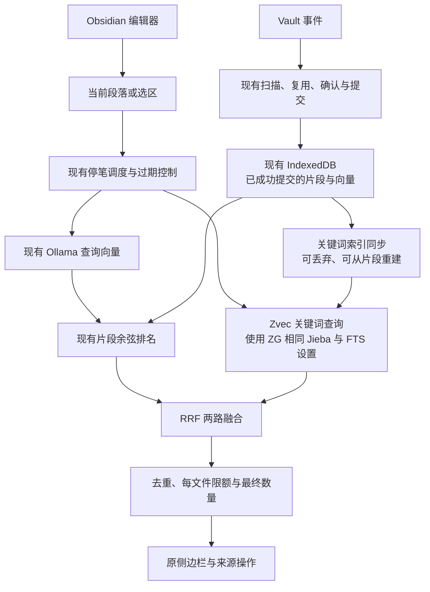

# 按实际实现拆开 ZG：Palimpsest Lite 拼装方案

## Summary

以用户给出的架构图为调查地图，核对了实际安装的 ZG 0.2.2 与 Zvec 0.7.1。结论是：**不用搬入整个 ZG，也不用先替换关键词库，可以直接复用 ZG 使用的 Zvec FTS/Jieba，沿用我们现有片段与向量排序，再接 RRF。**

该组合的关键词索引、原始中文查询、增删替换、重新打开、来源过滤及受控向量融合均已在 Node 中实测通过。不需要引入 ZG 的 scanner、Markdown extractor、模型目录、CLI、MCP 或 daemon。

这比上一轮“先推荐 MiniSearch”的推导更符合目标：先弄清 ZG 怎么拼，再保留所需的原装模块，最后决定简化。MiniSearch 保留为备选，不作为当前默认建议。

## 一、用户架构图与发布包的对应关系

图中的概念划分有助于理解，但需修正三处：

1. **关键词存储与向量存储由同一个 Zvec collection 提供**，不是 ZG TypeScript 层另建一个独立 BM25 数据库。`files.zvec` 存文件信息，`index.zvec` 存片段文本、位置、元数据和向量；文本字段为 FTS 索引，向量字段为 HNSW。
2. 已安装 Node 路径使用 `@zvec/zvec` 和平台 `.node` binding，不能根据图中的 `zvec-rust` 标签推断必须引入 Rust 或翻译语言。
3. Embedding 不是固定的 Potion/Transformers：模型 catalog 选择后端；此前实验的 Qwen3 使用 node-llama-cpp。检索是否引入 Zvec，与是否把 Ollama 替换成原生模型，是两个独立决定。

## 二、逐项拼装清单

| 图中部分 | ZG 实际实现 / 依赖 | 为什么存在 | Palimpsest 对应能力 | Lite 处理 |
|---|---|---|---|---|
| CLI、执行路由 | 命令参数解析、命令 dispatcher、direct/server 分派 | 人与脚本调用、选择服务模式 | 插件 commands 与编辑器事件 | 不带入 |
| MCP HTTP、认证 | MCP SDK、Node HTTP、loopback 和 token 检查 | Agent 远程/本地工具调用 | 没有此需求 | 不带入 |
| Daemon 与任务系统 | runtime manager、model pool、job scheduler、读写会话 | 常驻、多请求复用、后台索引 | Obsidian 生命周期与自动工作协调 | 保留我们的实现，不再加第二套服务 |
| 查询规划 | 统一 routes、路径/type/time 筛选 | 多路、多查询、多格式过滤 | 当前段落/选区、排除范围、当前文件 | 仅保留单查询、两路召回和必要路径过滤 |
| 文件发现 | Node fs、文件类型规则、glob/ignore、SHA256、路径 ID | 独立工作区扫描与变化发现 | Vault Markdown 文件、排除目录、事件队列与对账 | 保留我们的实现 |
| 代码提取 | web-tree-sitter、tree-sitter-wasms、各语言规则 | 符号检索 | 用户目标是 Markdown 笔记 | 不带入 |
| Markdown 分块 | ZG 自有标题/窗口算法、默认 3600 字符与 540 重叠（实际预算还受模型限制） | 保留章节结构、限制输入长度 | 自有段落分块、标题 breadcrumb、行号与 YAML 排除 | 第一版保留我们的分块；记录未复用 ZG 分块的差异 |
| 文本与图片提取 | text/image extractor、输入种类筛选 | 通用文件覆盖 | 非当前需求 | 不带入 |
| 文档 embedding 输入 | metadata 文本前缀、预算、截断、模型用途区分 | 内容加上下文、符合模型输入约束 | 文件名＋标题＋正文、现有 queryInstruction | 保留现有输入，不能宣称与 ZG 向量等价 |
| 模型运行 | node-llama-cpp / Transformers / Model2Vec / Qwen provider | 本地或远程模型选择 | Ollama provider | 保留 Ollama；不把 native 模型与关键词检索捆绑迁移 |
| 远程授权 | operation guard、授权 store | 私有内容调用远程模型 | 本地服务，不需要新远程 provider | 不带入 |
| 文件级索引更新 | hash/stat 差异、分批 embedding、失败重试、逐文件 replaceFile | 自带完整建库更新 | 片段复用、准备确认、durable commit、恢复 | 保留我们的流程，避免重新适配取消与复用 |
| 关键词检索 | `@zvec/zvec`：FTS text 字段，Jieba＋lowercase，querySync fts.matchString | 中文分词与文本排名 | 当前缺少 | 直接复用同一库与相同字段设置 |
| 向量检索 | 同一 Zvec collection 的 HNSW/cosine 等 schema | 大规模向量候选检索 | 精确余弦扫描 | 第一版继续使用我们的排序；是否引入 HNSW是独立规模问题 |
| 候选召回 | 深度从 200 开始，目标 max(5×limit,50)，不足可扩到 2000 | 分组与过滤后仍有足够候选 | 当前直接选五条 | 保留“先较宽召回、再融合与限额”，不复制代码符号与多 group 支持 |
| RRF | 各 route 的命中排名贡献 `1/(60+rank)`，合并后排序 | 两种分数无需归一化 | 当前只按余弦排序 | 使用同一标准算法，自己写短小实现，不依赖上游私有方法 |
| 精确/正则搜索 | `@vscode/ripgrep` 或 PATH 中 rg，spawn 获取结果 | 精确与穷举需求 | 非自动浮现的核心路径 | 不带入 |
| 结果格式化 | entity/group/evidence、范围、contentRole、状态 | Agent 可读的结构化结果 | 卡片、来源行号、拖动引用 | 转成原侧边栏结果，融合值不能冒充余弦 |
| 后台监听 | Node fs.watch、ChangeSet 压缩、定时对账 | 独立运行时捕获变化 | Vault 事件队列、启动对账、可见性协调 | 保留我们的机制，必要时参考路径压缩原理 |
| 配置与工作区状态 | 全局 config、manifest、文件状态 | 多入口共用运行环境 | 插件 data.json、稳定 Vault UUID | 不带入 ZG 全局配置，保留 Vault 隔离 |

判断依据是发布包源码，不将官方 main 或图示视为与 0.2.2 完全一致。

## 三、本轮直接复用 Zvec 的验证

### 组合

- 使用公开 `@zvec/zvec@0.7.1`，未加载 `@zvec/zvec-grep`。
- 使用现有 chunkMarkdown 生成片段，正文与 YAML 规则不变。
- 建一个只有标量字段的 collection：`text` 为 FTS，`file_path` 为过滤字段；**没有向量字段**。
- FTS 配置直接采用 ZG 的 Jieba＋lowercase。
- 向量排名继续调用项目现有 cosineSimilarity，使用手工受控向量检查融合机制。

### 实际通过

1. 无向量字段的独立关键词 collection 可建立与查询。
2. 现有分块排除 YAML 标记，标记无法被关键词检索。
3. 英文工具名、中文“混合检索”和“后端”可以命中。
4. 可按当前文件过滤。
5. 查询文本直接传 matchString，可以返回多词匹配结果；未建立自定义词规则。
6. 与现有向量打分通过 RRF 合并。
7. 同片段 ID 替换正文后旧词不命中、新词命中。
8. 关闭并重新打开后，新词仍命中；删除后不再命中。
9. 将 Zvec、Mac ARM64 binding、detect-libc 单独复制到独立临时目录，重复探针通过；不需要 ZG、node-llama-cpp 或模型缓存。

本轮加载独立目录内的库，但执行探针仍由项目 tsx 和现有源码提供。它证明最小底层运行组合可以拆出，**不证明完整安装包或 Obsidian E2E 已通过**。

### 体积

复制的三个运行包合计 `du -sk` 为 30,488 KiB，约 29.8 MiB，包含 native binding 与 Jieba 字典。是未压缩的本机文件占用，不是最终下载包体积。

相比完整 ZG 依赖快照约 596 MiB，这个拆法显著减少新增资源；它依然有平台 native 文件，不能继续称为纯三文件分发。现有 Ollama 模型需求没有因此增加或消失。

### 范围与局限

- 不是实际检索质量评测，向量使用人工受控值。
- 没有逐 token 输出或证明 Jieba 对全部中文术语正确。
- 未测大规模文本索引、优化耗时、内存或 Obsidian UI 阻塞。
- 未验证多进程、跨平台、原生库异常、磁盘失败和独立进程重启后的关键词恢复；本轮 reopen 在同一进程内执行。
- 关键词 collection 没有保存向量；未验证以后新增向量索引是否必要。
- Query 原文包含常用词时也可能命中其他笔记，探针记录了该现象；不据此即刻加入停用词或复杂启发式。

## 四、推荐架构：原有产品＋同源关键词底层＋精简融合



这就是按 ZG 蓝本拼出当前需要的链路：没有重新发明分词与关键词引擎；不把 ZG 的扫描、存储、模型、监听等整套实现搬入已经有对应能力的产品。

## 五、仍然需要做的连接工作

### 1. 两套索引不应成为两个真相源

现有 IndexedDB 保持唯一 durable 真相源；Zvec 关键词库只接受成功提交的片段。它可以丢弃重建，不能自己发现或写入未经现有流程确认的内容。

这使现有语义复用、取消、范围应用和重建保护继续生效，无需给每个操作发明第二套回滚。

但仍要处理：

- 关键词库与当前片段快照的对应记录。
- 提交后增删替换；路径/标题变化需要更新关键词输入。
- 更新失败或进程中断后，不能把旧关键词库当成最新状态。
- 对不一致状态先补同步，再混合查询；是否临时允许向量查询须明确显示，不悄悄返回旧关键词结果。
- 重建派生索引的成本；不能默认每次键入都同步重建整个关键词库。

“它能从现有数据重建”减少恢复复杂度，不等于同步问题已经解决。本轮探针只验证底层操作，不是完整同步实现。

### 2. 查询流程的简化

- 保留单段落、两条 route；删除多 query groups、代码符号偏好、强制追踪、复杂 evidence 结构。
- 当前文件与范围过滤应在确定候选排名的阶段考虑，不让它们占满候选后再简单删掉。
- 融合前保留足够宽的两路排名，再做每文件数量限制和去重。
- 候选深度先采用明确的有限值，不提前建设用户可配置的检索规划系统。最终值应结合性能和候选不足检查确定。
- RRF 的 rank 从 1 开始，缺席一路不贡献分数；同一路同片段不能重复贡献。
- 结果类型、分数提示与展开设置仍要调整，不能把原 similarity 字段装入融合值。

### 3. 哪些 ZG 规则值得参考但不直接搬

- 候选不足时扩展召回：保护融合有足够输入。第一版可用固定较宽召回，但要识别过滤后结果不足；不能只拼两路最终前五条。
- metadata 输入预算：说明模型上下文也有限。现有输入不应因为未换模型就假定与 ZG等价，当前不因此立刻重算全部向量。
- 长文本重叠窗口：与当前分块不同。若以后出现长文跨块遗漏，可单独参考，不必为了增加关键词检索同时改分块。
- 事件路径压缩：大批目录事件值得参考，但现有队列已经有不丢事件的保护，不需要加 daemon 才能获得思想。

## 六、复用方式与维护责任

- `@zvec/zvec` 作为独立的公开底层库使用，锁定版本；无需 Fork 整个 ZG。
- RRF 是标准算法，以公开描述和读到的流程为蓝本独立实现短小逻辑；本轮未把 ZG 源码复制进入正式产品。
- 若未来实际复制上游代码，需要保留其许可证与版权信息。此项是具体复制时的要求，不需要先建设审批流程。
- 我们负责的是片段与关键词库的连接、候选融合和界面，不负责重写 Jieba、BM25 或向量数据库。
- 升级 Zvec 时需验证其 FTS、过滤、更新与 native 兼容性；移除 CLI/MCP 不会移除这项责任。

## 七、复杂度判断

推荐同源底层 Lite 的本机工程复杂度粗估 **5/10**。分项判断：

- 查询与 RRF：低。
- 保留现有 YAML、片段复用、取消与重建流程：不再发生迁移，减少工作。
- 派生关键词库同步与失败恢复：中等，是主要新增代码。
- Native 库随插件部署：中等，但约 30 MiB 的底层组合比完整模型/runtime链路小得多。

不能由此承诺固定代码行数、工期或效果保留百分比。与纯 JS Lite 相比，同源词法行为更接近 ZG，但多了 native 包装和磁盘缓存职责；与完整 ZG 相比，保留更多现有工作并减少了运行依赖。

## 八、下一步与停止条件

1. 先基于本表收敛 Lite 方案，不继续同时扩张完整 ZG与替代关键词库两条路线。
2. 下一项最关键验证是：把这约 30 MiB 的底层组合放到独立 Obsidian 插件目录，确认它能加载、查询、更新和卸载。此前完整 ZG在 Obsidian 成功不能替代这个安装验证。
3. 在派生缓存的公开接口保护“只检索当前已提交片段、删除不残留、失败可重建”，再接原查询与侧边栏。
4. 若底层安装和缓存同步简单可行，再将本方案定为实施 spec；若它们反而要求完整双库存储事务或复杂安装器，报告具体代价，再考虑上一轮纯 JS候选。
5. 现阶段不修改正式项目依赖、代码、索引规则或正式 Vault，不宣称本方案已经完整验收。

## 九、证据与复现

- [原底层库探针结果](results/zvec-keyword-only.json)
- [独立底层运行目录探针结果](results/zvec-keyword-portable.json)
- [可复现探针](probes/zvec-keyword-only.mts)
- [上一轮 Lite 备选调查](lite-findings.md)

```bash
npx --no-install tsx .scratch/zg-backend/probes/zvec-keyword-only.mts \
  /absolute/path/to/experiment/node_modules/@zvec/zvec
```

### 已读的主要源码

ZG 发布包 `dist/` 下：

- `engine/pipeline/search/index.js`：候选聚合、动态深度、RRF。
- `engine/storage/zvec.js`：文件/片段存储、FTS与向量查询、schema。
- `engine/pipeline/indexing/index.js`：prepareFile、vectorContent、批量embedding、逐文件提交。
- `engine/extraction/runtime.js`、`markdown/extractor.js`、`vector-content.js`：提取路由、Markdown窗口和输入metadata。
- `engine/models/factory.js`、`models/backends/llama-cpp.js`：模型选择和用途格式。
- `engine/service/lexical.js`：ripgrep执行。
- `daemon/change-set.js`、`watch-manager.js`：监听、路径压缩与对账。
- `daemon/http-server.js`、`cli/index.js`：入口依赖与职责。

Zvec公开接口同时参照 Context7 获取的官方 Node文档与本地0.7.1类型声明；实际行为以探针为准。

本轮测试全部在临时索引目录完成。没有改正式产品代码、依赖或锁文件；没有运行生产完整测试，也没有重新操作 Obsidian 或正式 Vault。
